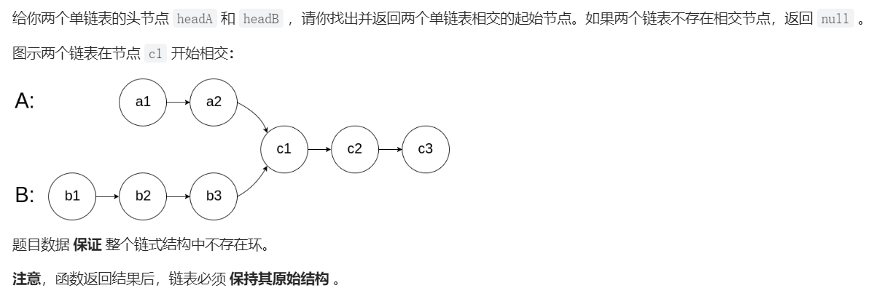

# 相交链表

# 一、题目描述



# 二、代码

## 法一：用ArrayList或HashSet


```java
import java.util.*;

/**
 * @author Kidd
 * @create 2022-05-07 10:49
 */

class ListNode {
     int val;
     ListNode next;
     ListNode(int x) {
         val = x;
         next = null;
    }
}

public class Solution {
    public ListNode getIntersectionNode(ListNode headA, ListNode headB) {

        List<ListNode> list = new ArrayList<>();
        while (headA != null) {
            list.add(headA);
            headA = headA.next;
        }
        while (headB != null) {
            if (list.contains(headB)) return headB;
            headB = headB.next;
        }
        return null;
    }


    public static void main(String[] args) {

        ListNode node5 = new ListNode(7);
        ListNode node4 = new ListNode(9);
        ListNode node3 = new ListNode(5);
        ListNode node2 = new ListNode(6);
        ListNode node1 = new ListNode(4);
        ListNode list1 = new ListNode(1);
        ListNode list2 = new ListNode(200);
        ListNode n1 = new ListNode(300);

        //list1 -> node1 -> node2 -> node3 -> node4 -> node5
        //1 4 6 5 9 7
        list1.next = node1;
        node1.next = node2;
        node2.next = node3;
        node3.next = node4;
        node4.next = node5;

        //list2 -> n1 -> node3 -> node4 -> node5
        //200  300   5  9  7
        list2.next = n1;
        n1.next = node3;
        node3.next = node4;
        node4.next = node5;
        ListNode intersectionNode = new Solution().getIntersectionNode(list1, list2);
        System.out.print(intersectionNode.val);
    }
}
```

## 法二：双指针

> 不需借助额外的空间


```java
class ListNode {
     int val;
     ListNode next;
     ListNode(int x) {
         val = x;
         next = null;
    }
}

public class Solution {
    public ListNode getIntersectionNode(ListNode headA, ListNode headB) {

        ListNode p1 = headA, p2 = headB;
        if(p1 == null || p2 == null) return null;

        while (p1 != p2) {
            // p1遍历完链表A之后开始遍历链表B，p2遍历完链表B之后开始遍历链表A
            if (p1 == null) p1 = headB;
            else p1 = p1.next;
            if (p2 == null) p2 = headA;
            else p2 = p2.next;
        }
        // 当指针pA 和pB 指向同一个节点或者都为空时时，返回它们指向的节点或者null
        return p1;
    }


    public static void main(String[] args) {

        ListNode node5 = new ListNode(7);
        ListNode node4 = new ListNode(9);
        ListNode node3 = new ListNode(5);
        ListNode node2 = new ListNode(6);
        ListNode node1 = new ListNode(4);
        ListNode list1 = new ListNode(1);
        ListNode list2 = new ListNode(200);
        ListNode n1 = new ListNode(300);

        //list1 -> node1 -> node2 -> node3 -> node4 -> node5
        //1 4 6 5 9 7
        list1.next = node1;
        node1.next = node2;
        node2.next = node3;
        node3.next = node4;
        node4.next = node5;

        //list2 -> n1 -> node3 -> node4 -> node5
        //200  300   5  9  7
        list2.next = n1;
        n1.next = node3;
        node3.next = node4;
        node4.next = node5;


        ListNode intersectionNode = new Solution().getIntersectionNode(list1, list2);

        System.out.print(intersectionNode.val);

    }
}
```

## 法三：转化为寻找环起点问题

```java
class ListNode {
     int val;
     ListNode next;
     ListNode(int x) {
         val = x;
         next = null;
    }
}

public class Solution {
    public ListNode getIntersectionNode(ListNode headA, ListNode headB) {
        // 题目要求链表必须保持其原始结构，用tail来复原
        ListNode p1 = headA, p2 = headB, tail = headA;
        if(p1 == null || p2 == null) return null;
        // 两条链表首尾相连，问题转化为寻找环起点问题
        while (tail.next != null) tail = tail.next;
        tail.next = p2;
        //将p1作为快指针，p2作为慢指针
        p2 = headA;
        while (p1 != null) {
            if (p1.next == null) p1 = p1.next;
            else p1 = p1.next.next;
            p2 = p2.next;
            // 两指针相遇时，让任意一个指针重新指向头结点,两指针同步前进
            if (p1 == p2) {
                p2 = headA;
                while (p1 != p2) {
                    p1 = p1.next;
                    p2 = p2.next;
                }
                // 复原链表
                tail.next = null;
                return p1;
            }
        }
        // 复原链表
        tail.next = null;
        return p1;
    }


    public static void main(String[] args) {

        ListNode node5 = new ListNode(7);
        ListNode node4 = new ListNode(9);
        ListNode node3 = new ListNode(5);
        ListNode node2 = new ListNode(6);
        ListNode node1 = new ListNode(4);
        ListNode list1 = new ListNode(1);
        ListNode list2 = new ListNode(200);
        ListNode n1 = new ListNode(300);

        //list1 -> node1 -> node2 -> node3 -> node4 -> node5
        //1 4 6 5 9 7
        list1.next = node1;
        node1.next = node2;
        node2.next = node3;
        node3.next = node4;
        node4.next = node5;

        //list2 -> n1 -> node3 -> node4 -> node5
        //200  300   5  9  7
        list2.next = n1;
        n1.next = node3;
        node3.next = node4;
        node4.next = node5;


        ListNode intersectionNode = new Solution().getIntersectionNode(list1, list2);

        System.out.print(intersectionNode.val);

    }
}
```

