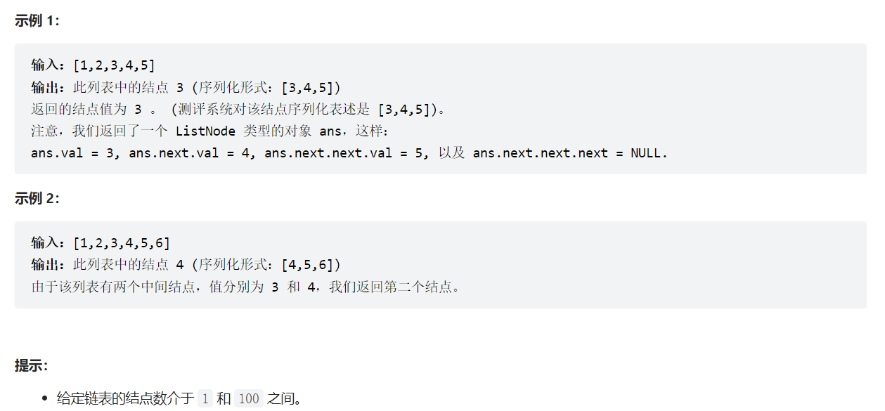

# 链表的中间结点

# 一、题目描述


# 二、示例



# 三、代码

## 法一：常规法

> 先遍历链表，计算结点个数sum，得到中间结点sum/2+1， 再遍历一次

```java
/**
 * @author Kidd
 * @create 2022-04-28 19:00
 */
class ListNode {
    int val;
    ListNode next;

    ListNode() {}

    ListNode(int val) {
        this.val = val;
    }

    ListNode(int val, ListNode next) {
        this.val = val;
        this.next = next;
    }
}

public class Solution {

    public ListNode middleNode(ListNode head) {
        if (head == null) return head;
        //创建头结点
        ListNode preHead = new ListNode(-1);
        preHead.next = head;
        // 计算结点数
        ListNode p = preHead;
        int sum = 0;
        while (p.next != null) {
            ++ sum;
            p = p.next;
        }
        //找中间结点
        p = preHead;
        for (int i = 1; i <= sum/2+1; ++i) {
            p = p.next;
        }
        return p;
    }

    public static void main(String[] args) {
        //lists -> node1 -> node2 -> node3 -> node4
        //1 4 6 5 9
        ListNode node4 = new ListNode(9);
        ListNode node3 = new ListNode(5, node4);
        ListNode node2 = new ListNode(6, node3);
        ListNode node1 = new ListNode(4, node2);
        ListNode lists = new ListNode(1, node1);

        ListNode middle = new Solution().middleNode(lists,2);
        System.out.print(middle.val);
    }
}
```

## 法二：快慢指针

> 只遍历一次

```java
class ListNode {
    int val;
    ListNode next;

    ListNode() {}

    ListNode(int val) {
        this.val = val;
    }

    ListNode(int val, ListNode next) {
        this.val = val;
        this.next = next;
    }
}

public class Solution {

    class Solution {
    public ListNode middleNode(ListNode head) {
        //创建头结点
        ListNode preHead = new ListNode(-1);
        preHead.next = head;
        // 快指针每次走两步，慢指针每次走一步
        ListNode fast = preHead, slow = preHead;

        while (fast != null) {
            if (fast.next != null) fast = fast.next.next;
            //结点数为偶数时，需处理
            else fast = fast.next;
            slow = slow.next;
        }
        return slow;
    }
}

    public static void main(String[] args) {
        //lists -> node1 -> node2 -> node3 -> node4
        //1 4 6 5 9
        ListNode node4 = new ListNode(9);
        ListNode node3 = new ListNode(5, node4);
        ListNode node2 = new ListNode(6, node3);
        ListNode node1 = new ListNode(4, node2);
        ListNode lists = new ListNode(1, node1);


        ListNode middle = new Solution().middleNode(lists,2);
        System.out.print(middle.val);
    }
}
```

