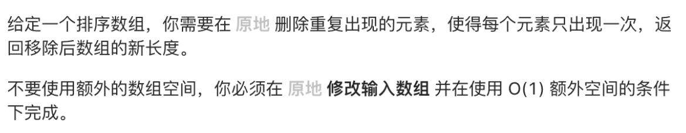
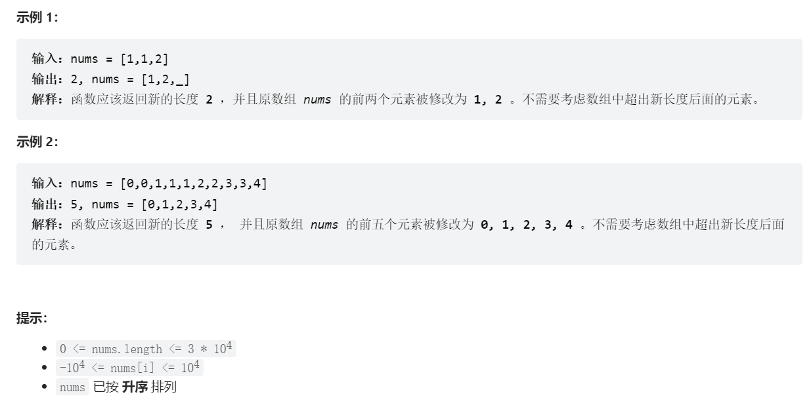

# 删除有序数组中的重复项

# 一、题目描述



# 二、示例



# 三、代码

### Java版

```java
/**
 * @author Kidd
 * @create 2022-05-08 9:36
 */


/*
 * 不使用额外的空间，必须在原地修改数组 并在使用 O(1) 额外空间的条件下完成
 */
public class Solution {
    public int removeDuplicates(int[] nums) {
        if (nums.length == 0) return 0;
        int slow = 0, fast = 1;
        while (fast < nums.length) {
            // 找到不重复元素先让slow前进一步再赋值，就可保证[0..slow]都是不重复元素
            if (nums[slow] != nums[fast]) {
                nums[++slow] = nums[fast];
            }
            ++fast;
        }
        // 返回去重后元素个数
        return slow + 1;
    }

    public static void main(String[] args) {
        System.out.println(new Solution().removeDuplicates(new int[]{0,0,1,1,1,2,2,3,3,4}));
    }
}
```
